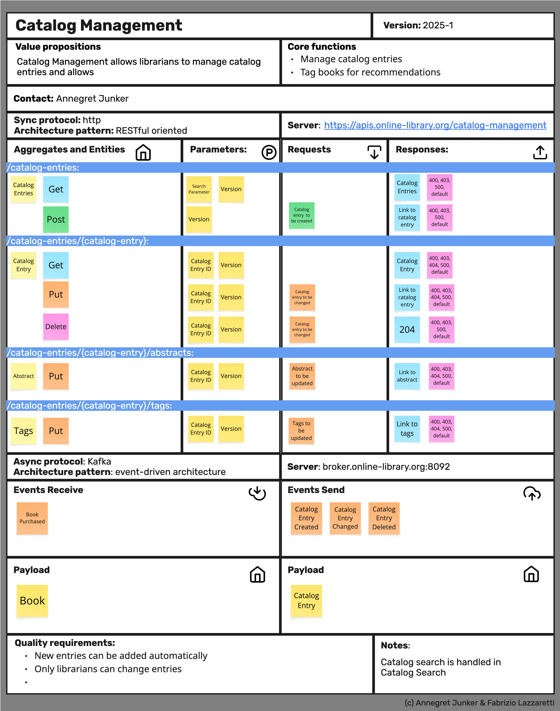
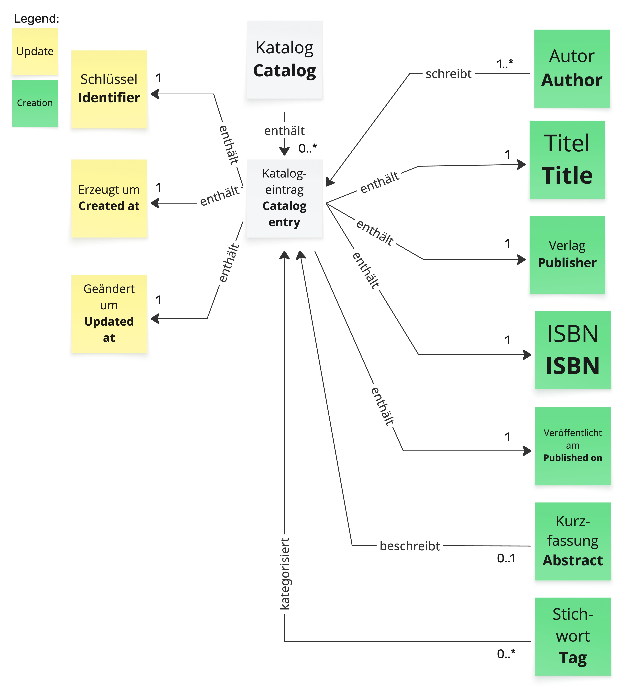
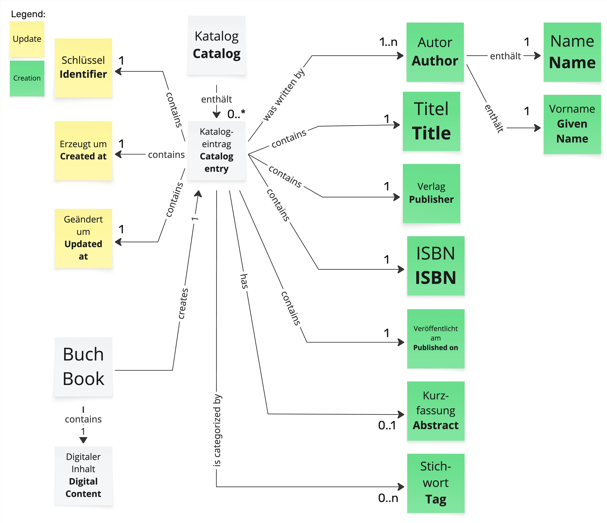
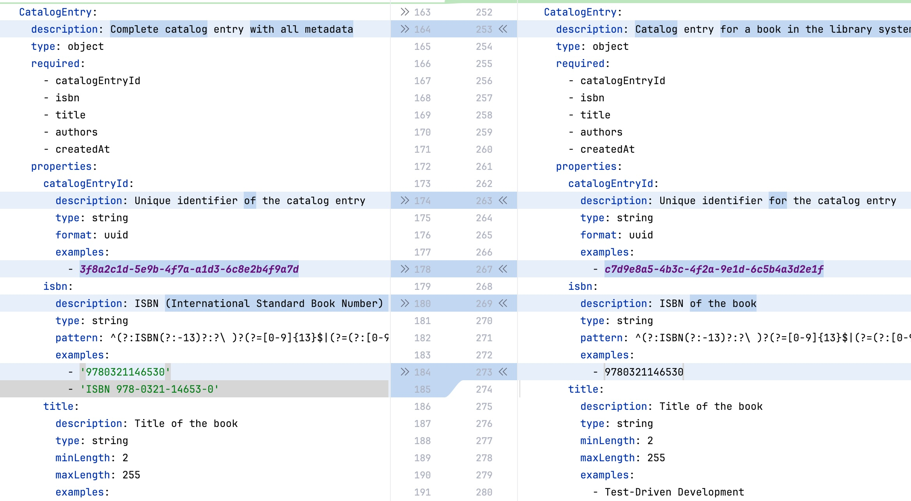
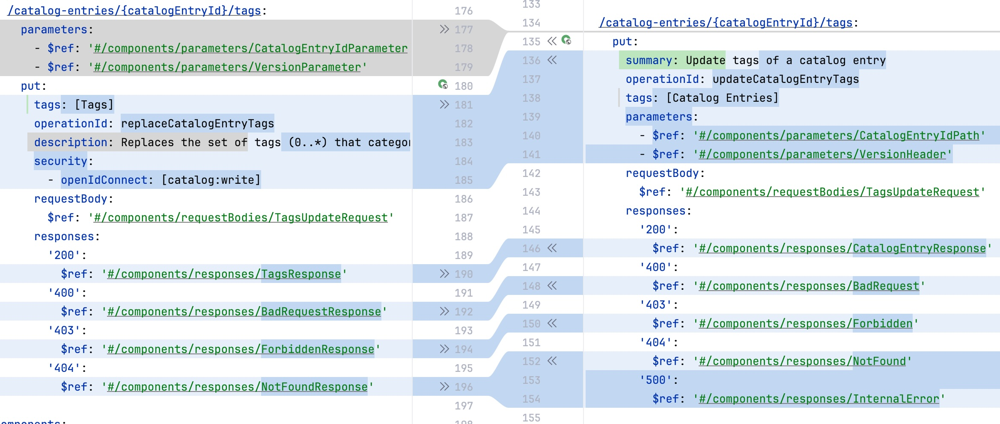
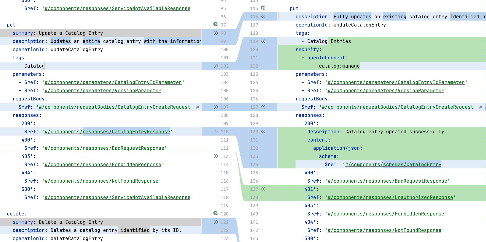
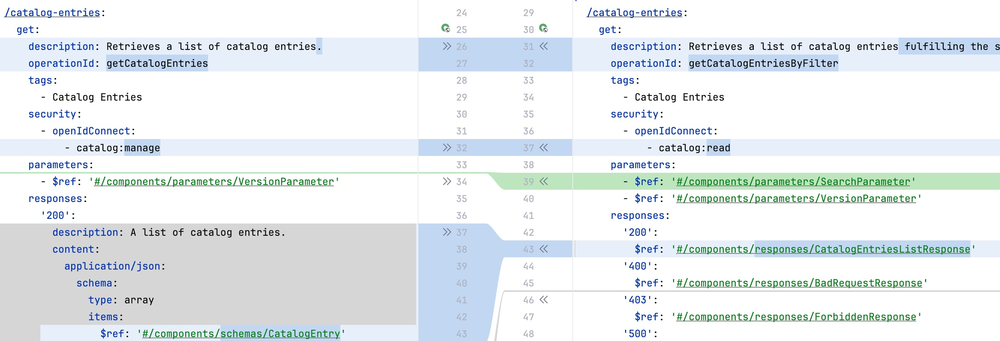

# AI Comparison

This is path contains comparisons of generated APIs with different LLMs in different versions.
The APIs are created based 
- on a picture of an API Product Canvas _(see Junker, A; Lazzaretti, F. (2025) Crafting Great APIs using DDD, Apress)_,
- a Visual Glossary _(see Zörner, S. (2015). Softwarearchitekturen dokumentieren und kommunizieren, Entwürfe, Entscheidungen und Lösungen nachvollziehbar und wirkungsvoll festhalten (Document and Communicate Software Architectures: Traceable and Effective Capturing of Decisions and Solutions). München: Hanser Verlag.)_, and
- an example in OpenAPI and AsyncAPI.

The generated APIs are linted with the [Spectral](https://docs.stoplight.io/docs/spectral/674b27b261c3c-overview) linter and standard rules.

## Overview

| Grade     | Provider  | Model             | Sync/Async | Details                              |
|-----------|-----------|-------------------|------------|--------------------------------------|
| Excellent | Anthropic | Claude Sonnet 4.5 | Async      | [Sonnet 4.5](#Sonnet-45)             |
| Excellent | Anthropic | Claude Opus 4.1   | Async      | [Opus 3.1](#Opus-41)                 |
| Very Good | Anthropic | Claude Sonnet 4.5 | Sync       | [Sonnet 4.5](#Sonnet-45)             |                        
| Very Good | Anthropic | Claude Opus 4.1   | Sync       | [Opus 3.1](#Opus-41)                 |               
| Very Good | Google    | Gemini 2.5 Pro    | Sync       | [Gemini 2.5 Pro](#Gemini-25-Pro)     |
| Very Good | Google    | Gemini 2.5 Pro    | Async      | [Gemini 2.5 Pro](#Gemini-25-Pro)     |
| Very Good | Google    | Gemini 2.5 Flash  | Sync       | [Gemini 2.5 Flash](#Gemini-25-Flash) |
| Good      | OpenAI    | ChatGPT 5         | Sync       | [ChatGPT 5](#ChatGPT-5)              |            
| Good      | OpenAI    | ChatGPT 5         | Async      | [ChatGPT 5](#ChatGPT-5)              |
| Good      | Google    | Gemini 2.5 Flash  | Async      | [Gemini 2.5 Flash](#Gemini-25-Flash) |
| Fair      | OpenAI    | ChatGPT 4         | Sync       | [ChatGPT 4](#ChatGPT-4)              |
| Fair      | Microsoft | Copilot           | Sync       | [Copilot](#Microsoft-Copilot)        |
| Poor      | OpenAI    | ChatGPT 4         | Async      | [ChatGPT 4](#ChatGPT-4)              |
| Poor      | Microsoft | Copilot           | Async      | [Copilot](#Microsoft-Copilot)        |      

The detail information can be found below in the descriptions of the result.

## Scenario

The scenario handles the bounded context _Catalog Management_ in an online library. 

The _Catalog Management_ bounded context creates, updates, and deletes Catalog Entries in the library catalog. Those entries can be created automatically triggered by new purchases or can be cared for by a librarian.

## API Product Canvas

The following figure shows the API Product Canvas of the bounded context.

The canvas shows the endpoints of a REST-API and the events for asynchronous communication.

## Visual Glossary

The belonging Visual Glossary shows the domain model of the bounded context with the aggregate _Catalog Entries_.

For the asynchronous communication the Visual Glossary needs to be enhanced by Published Language models of the events consumed by the bounded context. Therefore, the Visual Glossary is enhanced to cover the consumed events from Purchase.

## Examples

As OpenAPI example a simple [Task Management API](./TaskManagement.yaml) is used.

As AsyncAPI example the definition of an [Inventory Management](./InventoryManagement.aas.yaml) of an online library is used. It contains besides the event and schema definition the necessary Kafka bindings.

## Prompts

- The prompt for the OpenAPI generation: [Prompt](PromptOpenApi).
- The prompt for the AsyncAPI generation: [Prompt](./PromptAsyncApi.md).

## Linting

The generated results are linted using the standard rule set by [Spectral](https://docs.stoplight.io/docs/spectral/aa15cdee143a1-java-script-ruleset-format).

## Results

### Anthropic

#### Sonnet 4.5

[OpenAPI](./Claude/Sonnet45CatalogManagement.oas.yaml),
[Linting OpenAPI](./Claude/Sonnet45Linting.oas.md), [Chat](https://claude.ai/share/85a0b43e-6ca0-4c51-92a9-df5b8601509f)

The result is good and satisfying.
Examples in the schemas are missing.

[AsyncAPI](./Claude/Sonnet45CatalogManagement.aas.yaml),
[Linting AsyncAPI](./Claude/Sonnet45Linting.aas.md),
[Chat](https://claude.ai/share/dfa9af37-d00b-461b-8fa0-2f9c25d25c2f)

The result is very good.
Examples are given based on the near example of the same domain.
The linting shows no errors.

#### Opus 4.1

[OpenAPI](./Claude/Opus41CatalogManagement.oas.yaml), [Linting OpenAPI](./Claude/Opus41Linting.oas.md), [Chat](https://claude.ai/share/d262fcf6-6097-4523-a90b-63c4a9393596)

The result is good.
The generator has not done a separation between event and synchronous API. 
Book is defined as schema, but is not used, because it is only used in events.

[AsyncAPI](./Claude/Opus41CatalogManagement.aas.yaml), [Linting AsyncAPI](./Claude/Opus41Linting.aas.md), [Chat](https://claude.ai/share/2131b43e-5379-4ace-84f5-fe94a219e1ca)

The result is very good.
Examples are given based on the example of the same domain.
The linting shows no errors.

The AsyncAPIs of Sonnet4.5 (left) and Opus4.1 (right) are almost identical.

### OpenAI

#### ChatGPT 5

[OpenAPI](./OpenAI/ChatGpt5CatalogManagement.oas.yaml), [Linting OpenAPI](./OpenAI/ChatGpt5Linting.oas.md), [Chat](https://chatgpt.com/share/68e26af7-4df0-800e-b4e8-6749a3ce586b)

The result is medium.
The generator has not done a separation between event and synchronous API.
The schema does not contain examples nor descriptions.
Book is defined as schema, but is not used, because it is only used in events.
Single type definition of every property increases complexity and makes the definition less human-readable.

[AsyncAPI](./OpenAI/ChatGpt5CatalogManagement.aas.yaml), [Linting AsyncAPI](./OpenAI/ChatGpt5Linting.aas.md), [Chat](https://chatgpt.com/share/68e26c6d-aadc-800e-8173-27a5da6d247a)

The result is medium.
The linting is not free of warnings.
The generated code does not contain examples nor descriptions.
Recognition of definitions which can be taken over is very good.
Code comments are very good.

#### ChatGPT 4

[OpenAPI](./OpenAI/ChatGpt4CatalogManagement.oas.yaml), [Linting OpenAPI](./OpenAI/ChatGpt4Linting.oas.md), [Chat](https://chatgpt.com/share/68e275ad-c8e8-800e-a065-5cac4c55b701)

The chat takes a while and several prompts until the result could be reached.

The info block defines events in an extensible tag, which is not necessary.
Not all required response codes are defined.

The result could be usable, but needs a lot of rework.
The linting contains warnings.
There are neither descriptions nor examples.
The security scopes are left out.
Strings do not contain formatting information.

[AsyncAPI](./OpenAI/ChatGpt4CatalogManagement.aas.yaml), [Linting AsyncAPI](./OpenAI/ChatGpt4Linting.aas.md), [Chat](https://chatgpt.com/share/68e27881-07b8-800e-86aa-500600f5c960)

The chat needs two prompts.

The result is not usable.

Not all required response codes are defined.

Descriptions and examples are missing.
The schema formulation needs a lot of rework.
Book is not seen as source of the catalog entry values.

Even though ChatGPT 5 is difficult to use for API generation, there are principle differences between ChatGPT5 and 4.

### Gemini

#### Gemini 2.5 Pro

[OpenAPI](./Gemini/Gemini25ProCatalogManagement.oas.yaml), [Linting OpenAPI](./Gemini/Gemini25ProLinting.oas.md), [Chat](https://docs.google.com/document/d/1XFlyOr7oo71OG-jjMY6znBUCFA3PYrKlZFjmd-qOnAY/edit?usp=sharing)

The API looks clean, but does not have any examples.
There are some security scopes in the read-only endpoints missing.
The responses are cleaner defined as in the Flash version, see following figure with Pro-Version on left and the Flash-Version on the right.

[AsyncAPI](./Gemini/Gemini25ProCatalogManagement.aas.yaml), [Linting AsyncAPI](./Gemini/Gemini25ProLinting.aas.md), [Chat](https://docs.google.com/document/d/1Kb-T1deGpkKccMG_-L5SJpT_cdEHhvQwArtDYTOmBoM/edit?usp=sharing)

The specification is useful.
Some descriptions and examples are missing.
The event *Book Purchased* is handled.
 
#### Gemini 2.5 Flash

[OpenAPI](./Gemini/Gemini25FlashCatalogManagement.oas.yaml), [Linting OpenAPI](./Gemini/Gemini25FlashCatalogManagement.oas.yaml), [Chat](https://docs.google.com/document/d/1BPaDJpmxkPXFGP4ZANrPTTlO6CEPm40ifkf-iDDaVYE/edit?usp=sharing)

The generated API is useful and good.
Examples are missing.

A comparison between Gemini 2.5 Flash (left) and Claude Sonnet 4.5 (right) shows that the generation with Claude is cleaner.

[AsyncAPI](./Gemini/Gemini25FlashCatalogManagement.aas.yaml), [Linting AsyncAPI](./Gemini/Gemini25FlashLinting.aas.md), [Chat](https://docs.google.com/document/d/18YOZhxLlakNBLiq7_5EDWQ5Sbknn2c7NGoHW1kHIc_Q/edit?usp=sharing)

Syntactically, the AsyncAPI is not bad.
However, the *Book Purchased* event is missing.
It would need to be added manually.
In the schema, examples are missing.

### Microsoft Copilot

[OpenAPI](./Copilot/CopilotCatalogManagement.oas.yaml), [Linting OpenAPI](./Copilot/CopilotLinting.oas.md), [Chat](https://copilot.microsoft.com/shares/EZawTkjaHhbyTAGJMD2n6)

The API specification is hardly useful.
For the generation the example specification cannot be uploaded. It must be copied and pasted into the prompt.
Descriptions and examples are missing.
Strings do not have either minLength/maxlength nor patterns.
For the identifier no format as uuid is given.

[AsyncAPI](./Copilot/CopilotCatalogManagement.aas.yaml), [Linting AsyncAPI](./Copilot/CopilotLinting.aas.md), [Chat](https://copilot.microsoft.com/shares/exDgvjTQfMJoZc3ADdJvq)

The API specification is not useful.
For the generation the example specification cannot be uploaded. It must be copied and pasted into the prompt.
The API specification contains syntactical errors.
The schema definition is not satisfying and misses descriptions and examples.
Schema examples are defined as separated property. 

